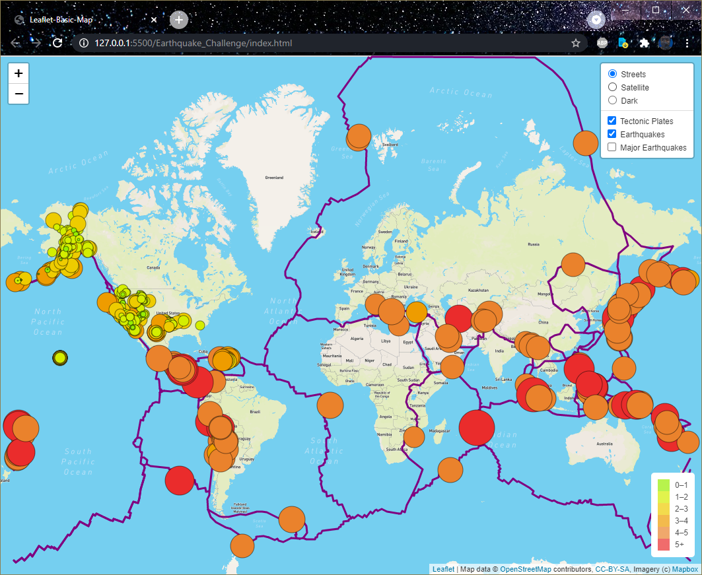

# Mapping_Earthquakes

The purpose of this assignment is to demonstrate skills using GeoJSON (https://geojson.org/) sources in Mapbox

The following objects were created in the module: `Point`, `LineString`, `Polygon`, `MultiPoint`, `MultiLineString`, and `MultiPolygon`.

Mapbox using MapBox GL JS https://docs.mapbox.com/mapbox-gl-js/api/ with focus on Styles API https://docs.mapbox.com/api/maps/styles/

Leaflet Javascript library to make interactive maps https://leafletjs.com/index.html

Traverse and use the geojson file from USGS

https://earthquake.usgs.gov/earthquakes/feed/v1.0/geojson.php

https://earthquake.usgs.gov/ GeoJson Feeds https://earthquake.usgs.gov/earthquakes/feed/v1.0/geojson.php

Also for fun, attempted to look up other GeoJson files that could be included on this chart... such as Volcanic Activity https://www.usgs.gov/products/data-and-tools/real-time-data/volcanoes

The Challenge can be found here: [Earthquake_Challenge](Earthquake_Challenge) 

